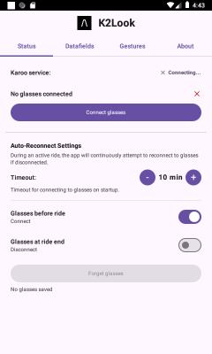
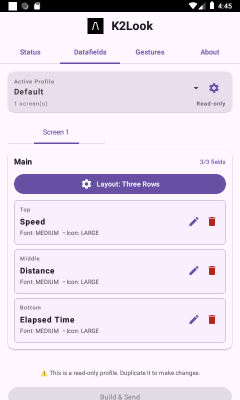
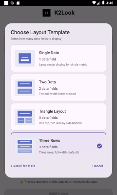
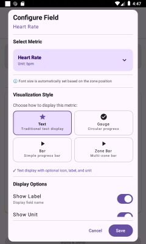
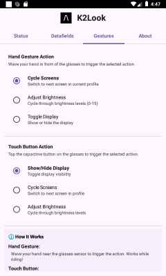
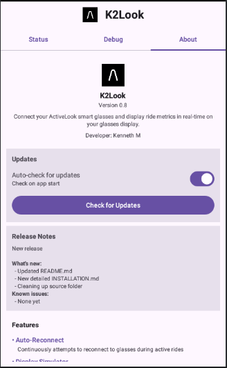
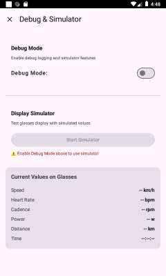

# Karoo2 ↔ ActiveLook (K2-Look)

## ⚠️ Disclaimer

This is a **personal project** shared with the community.  
The software is provided **"as is"** without warranty of any kind.  
Please use at your own risk.  
This is my very first Android app, so please be patient with bugs and rough edges!

**What this means:**

- ✅ Bug reports and issues are welcome and appreciated
- ✅ Compatibility issues can be reported
- ⚠️ Fixes are provided on a best-effort basis with no guarantees
- ⚠️ Support for different ActiveLook glasses brands can only be done if I have access to the
  hardware
- 💡 Community contributions, feature request and testing are encouraged!

This project is developed and tested
with [Engo2](https://engoeyewear.com/products/engo-2-photochromic).
Function may vary with different devices, but should generally work with any ActiveLook glasses.

---

Real-time data gateway between Hammerhead Karoo2 and (hopefully any) ActiveLook glasses, .

## Project Status

Project is in **active development**.  
Engo 2 has been used to test core functionality.

### Key Features

#### 🖐️ **Hands-Free Gesture & Touch Control**

Control your display without touching your Karoo during rides - perfect for safety and convenience!

**✨ Gesture Actions (Wave Hand):**

- 🔄 **Cycle Screens** - Switch between your configured screens (Default)
- 🔆 **Adjust Brightness** - Cycle through brightness levels (4→8→12→15)
- 📺 **Toggle Display** - Turn display on/off to save battery

**👆 Touch Actions (Tap Button):**

- 📺 **Show/Hide Display** - Quick display toggle (Default)
- 🔄 **Cycle Screens** - Switch between screens
- 🔆 **Adjust Brightness** - Adjust brightness levels

**How It Works:**

- **Hand Gesture**: Wave your hand near the glasses sensor
- **Touch Button**: Short tap (<3s) on the capacitive button
- **Configure**: Select your preferred actions in the Gestures tab
- **During Ride**: Keep your hands on the handlebars, control display with gestures!

**Perfect For:**

- 🏋️ **Interval Training** - Switch between "Steady", "Intervals", and "Recovery" screens
- 🌄 **Multi-Terrain** - Change from "Road" to "Climb" to "Recovery" views
- ☀️ **Changing Light** - Adjust brightness when entering tunnels or bright sun
- 🔋 **Battery Saving** - Turn off display on long flat sections

#### 🎨 **Built-in DataField Builder**

K2Look includes a powerful **DataField Builder** that lets you create custom display layouts
directly on your Karoo 2 - no smartphone app needed!

**✨ What You Can Do:**

- ✅ Choose from **6 professional layout templates** (1-6 data fields)
- ✅ Select from **23 real-time metrics** from your Karoo 2
- ✅ Use **4 visualization styles**: Text, Gauge, Bar, and Zoned Bar
- ✅ Create **multiple profiles** for different bikes or activities
- ✅ **Automatic profile switching** based on Karoo ride profile name
- ✅ Configure everything **without glasses connected** - edit anytime, anywhere

**📊 Supported Metrics (23 total):**

- **General**: Elapsed Time, Distance
- **Heart Rate**: HR, Max HR, Avg HR, HR Zone
- **Power**: Power, Max Power, Avg Power, Power 3s, Power Zone
- **Speed**: Speed, Max Speed, Avg Speed
- **Cadence**: Cadence, Max Cadence, Avg Cadence
- **Climbing**: VAM, Avg VAM

**🎨 Visualization Styles:**

1. **📝 Text** - Traditional display with label, unit, and icon (all 23 metrics)
2. **⊙ Gauge** - Circular progress gauge ~270° arc (21 metrics)
3. **▬ Bar** - Horizontal progress bar (21 metrics)
4. **▦ Zoned Bar** - Multi-zone training bars with color coding
    - Heart Rate: 5 zones (Z1-Z5)
    - Power: 7 zones (Z1-Z7) based on FTP

**📐 Layout Templates:**

- Single Data (1 field) - Focus on one metric
- Two Data (2 fields) - Two equally important metrics
- Triangle Layout (3 fields) - One top + two bottom
- Three Rows (3 fields) - Balanced view ✅ Default
- Four Data (4 fields) - Multiple key metrics
- Six Data (6 fields) - Maximum data density

**🔄 Real-time Updates:**
All metrics update at **1Hz** (1 update/second) for optimal BLE performance and battery life.

## Project Overview

This Karoo Extension provides a **complete data visualization solution** for ActiveLook smart
glasses, featuring:

- **Hands-Free Gesture & Touch Control** - Wave hand or tap button to control display during rides
- **Built-in DataField Builder** - Create custom layouts directly on your Karoo 2
- **23 real-time metrics** - All cycling data you need (HR, Power, Speed, Cadence, VAM, and more)
- **4 visualization styles** - Text, Gauge, Bar, and Zoned Bar
- **6 professional templates** - From minimal (1 field) to data-dense (6 fields)
- **Automatic profile switching** - Match your Karoo ride profiles
- **Training zone support** - HR zones (Z1-Z5) and Power zones (Z1-Z7 based on FTP)

**No smartphone app required!** Configure everything directly on your Karoo 2 using the intuitive
DataField Builder interface. Control your display with hand gestures for safer, hands-free riding!

> **See [DataField Builder Guide](./docs/DataFieldBuilder.md)** for complete documentation on
> creating custom layouts, choosing visualization styles, and configuring training zones.

## Screenshots


*Status Tab: Connect to ActiveLook glasses and view connection status.*


*DataFields Tab: Create and manage custom display profiles with the built-in DataField Builder.*


*Custom Profiles: Create multiple profiles for different bikes or activities.*


*Layout Templates: Choose from 6 layout templates (1-6 data fields).*


*Metric Selector: Choose from 23 real-time metrics from your Karoo2.*


*Gesture Tab: Configure hand gesture and touch button actions for hands-free control.*


*About Tab: View app version, enable debug.*


*Debug View: Real-time data stream monitoring for troubleshooting.*

## Repository Structure

```
/
├── app/                    # Main application code
├── reference/              # Vendored dependencies (included in repo)
│   ├── android-sdk/       # ActiveLook Android SDK (v4.5.6)
│   └── karoo-ext/         # Karoo Extensions SDK (v1.1.7)
└── [gradle files]
```

## Reference Projects

The `reference/` directory contains **vendored copies** of upstream repositories that are **included
directly in this repository**. These provide source code for the ActiveLook SDK and Karoo Extensions
library that the app builds against.

**Why vendored instead of downloaded?**

- Ensures consistent builds across all environments
- CI/CD pipelines work without external dependencies
- Custom build fixes are maintained across updates
- No authentication required for building

**Included projects:**

- **`reference/android-sdk`
  ** → [ActiveLook Android SDK](https://github.com/ActiveLook/android-sdk) (v4.5.6)
- **`reference/karoo-ext`** → [Karoo Extensions](https://github.com/hammerheadnav/karoo-ext) (
  v1.1.7)

These are committed to the repository, so **no setup scripts are needed** - just clone and build!

> **Note:** The `setup-references.*` and `update-references.*` scripts in the repository root are *
*deprecated** and no longer needed since reference projects are now vendored directly in the repo.

### Cloning This Repository

```bash
git clone https://github.com/kemaMartinsson/k2-look.git
cd k2-look
.\gradlew :app:assembleDebug  # That's it! Reference projects are already included
```

## Development Setup

### Install Android Studio

1. **Download Android Studio**
    - Visit [developer.android.com/studio](https://developer.android.com/studio)
    - Download the latest stable version for Windows

2. **Install Android Studio**
    - Run the installer
    - Follow the setup wizard (install Android SDK, Android Virtual Device)
    - Choose "Standard" installation type

3. **Configure Android SDK**
    - Open Android Studio
    - Go to **Settings → Appearance & Behavior → System Settings → Android SDK**
    - Ensure these are installed:
        - Android SDK Platform 30 (or higher)
        - Android SDK Build-Tools 30.0.3 (or higher)
        - Android SDK Platform-Tools

4. **Open the Project**
    - In Android Studio: **File → Open**
    - Navigate to the cloned repository directory
    - Let Gradle sync (may take several minutes on first run)

### Alternative: VSCode with Dev Container

For developers who prefer Visual Studio Code, a devcontainer configuration is available (currently
disabled):

1. **Enable the Dev Container:**
    - Rename `.devcontainer.disabled/` to `.devcontainer/`
    - This folder contains Docker configuration for a complete Android development environment

2. **Prerequisites:**
    - Install [Docker Desktop](https://www.docker.com/products/docker-desktop)
    - Install [Visual Studio Code](https://code.visualstudio.com/)
    - Install the "Dev Containers" extension in VSCode

3. **Open in Container:**
    - Open VSCode
    - Press **F1** and select **"Dev Containers: Open Folder in Container..."**
    - Navigate to the cloned repository
    - VSCode will build and start the development container (first time takes several minutes)

4. **Build in Container:**
    - Once the container is running, open the integrated terminal
    - Run: `./gradlew :app:assembleDebug`

> **Note:** The devcontainer is disabled by default to avoid confusion for Android Studio users. It
> provides a consistent Linux-based development environment with all necessary tools pre-installed.

## Quick Start

### 1. Building

```bash
.\gradlew :app:assembleDebug
```

**Expected output:** APK in `app/build/outputs/apk/debug/`

### 2. Installation on Karoo2

**Via ADB (recommended for development):**

```bash
adb devices  # Verify Karoo2 is connected
adb install -r app/build/outputs/apk/debug/*.apk
```

**Via File Transfer:**
Transfer the APK to your Karoo2 and install it.

### 3. First Run

1. Launch "K2Look" on your Karoo2
2. Grant Bluetooth and Location permissions when prompted
3. **Go to "Datafields" tab** to configure your display:
    - Create a profile or use the Default profile
    - Select metrics to display
    - Choose visualization styles (Text, Gauge, Bar, Zoned Bar)
    - Pick a layout template (1-6 fields)
4. **Go to "Gestures" tab** to configure hands-free control:
    - Select hand gesture action (default: Cycle Screens)
    - Select touch button action (default: Show/Hide Display)
    - Settings save automatically
5. **Go to "Status" tab** to connect to your glasses:
    - Turn on your ActiveLook glasses
    - Tap **"Scan for Glasses"**
    - Select your glasses from the list
    - Wait for "Connected" status
6. **Start a ride** - Your custom layout appears on your glasses automatically!
7. **During ride** - Wave hand or tap button to control display without touching Karoo!

> **💡 Pro Tip:** Create multiple profiles with different names matching your Karoo ride profiles for
> automatic switching! Use gestures to switch between screens hands-free.

## Documentation

### Getting Started

- 📘 [Quick Start & Testing Guide](./docs/Quick-Start-Testing-Guide.md) - **Start here for
  deployment!**
- 🎨 [DataField Builder Guide](./docs/DataFieldBuilder.md) - **Complete guide to creating custom
  layouts**
- 🛠️ [Development Setup Guide](./docs/Karoo2-ActiveLook-Dev-Setup.md)

## External Resources

### Karoo

- [Karoo Extensions Documentation](https://hammerheadnav.github.io/karoo-ext/index.html)
- [Karoo Extensions GitHub](https://github.com/hammerheadnav/karoo-ext)
- [Developer Community](https://support.hammerhead.io/hc/en-us/community/topics/31298804001435-Hammerhead-Extensions-Developers)

### ActiveLook

- [ActiveLook Android SDK](https://github.com/ActiveLook/android-sdk)
- [ActiveLook API Documentation](https://github.com/ActiveLook/Activelook-API-Documentation)
- [Development Guide](https://www.activelook.net/news-blog/developing-with-activelook-getting-started)
- [Demo App](https://github.com/ActiveLook/demo-app)

## Architecture

```
User Configuration (DataField Builder)
        ↓
DataFieldProfile → LayoutBuilderViewModel
        ↓
Karoo2 Sensors → KarooSystemService → KarooDataService
                                            ↓
                                  KarooActiveLookBridge
                                     (transformation + layout engine)
                                            ↓
                              ActiveLookService → Glasses Display
                              (Text/Gauge/Bar/Zoned Bar rendering)
```

**Key Components:**

- **LayoutBuilderViewModel** - Profile and layout management
- **DataFieldProfile** - User-defined metrics and visualization configurations
- **KarooDataService** - Consumes Karoo data streams (23 metrics)
- **ActiveLookService** - Manages BLE connection and display rendering
- **KarooActiveLookBridge** - Coordinates both services, transforms data, applies layouts
- **MainViewModel** - UI state management
- **MainScreen** - Jetpack Compose UI with 4 tabs (Status, Datafields, Debug, About)

## Contributing

This is a personal development project.  
If you have suggestions or find issues, feel free to open an
issue or discussion.

**Bug Reports:** Please include:

- Karoo firmware version
- ActiveLook glasses model
- Steps to reproduce
- LogCat output (if available)

## License

See [LICENSE](./LICENSE) file for details.

---

**Made with ❤️ for the K2 community**

