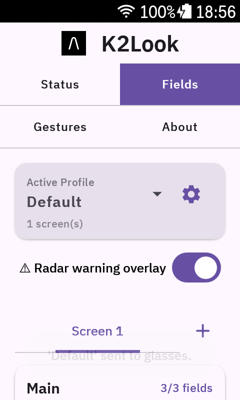
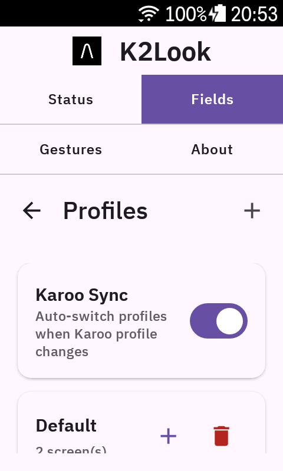
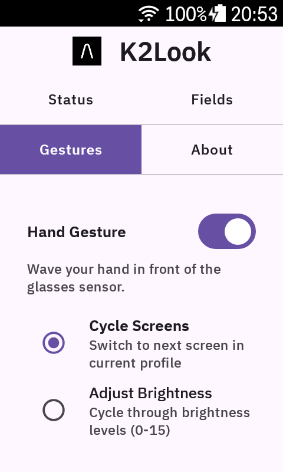
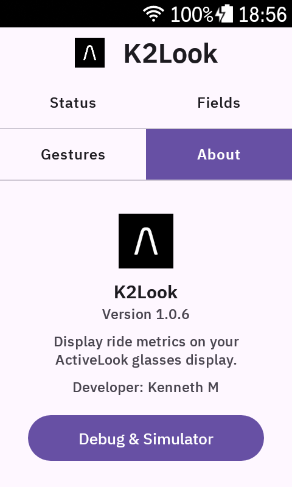
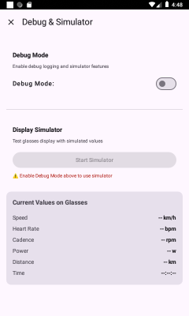

# Karoo2 ↔ ActiveLook (K2-Look)

[](LICENSE)
[](https://github.com/kemaMartinsson/k2-look/releases/latest)
[](https://github.com/kemaMartinsson/k2-look/actions/workflows/android-validate.yml)
[](https://github.com/kemaMartinsson/k2-look/stargazers)

**K2Look** connects your Hammerhead Karoo 2 to ActiveLook smart glasses, displaying real-time
cycling metrics in your field of vision with hands-free gesture control.

📥 **[Download Latest Release](https://github.com/kemaMartinsson/k2-look/releases/latest)** | 📖 *
*[Installation Guide](./docs/INSTALLATION.md)** | 🎨 *
*[DataField Builder Guide](./docs/DataFieldBuilder.md)**

## 📑 Table of Contents

- [Features](#key-features)
- [Screenshots](#screenshots)
- [Installation](#-installation) - **For end users**
- [Before a ride](#-before-a-ride) - **User configuration**
- [Quick Start](#quick-start) - **For developers**
- [Useful Commands](#-useful-commands) - **Build, test, CI, ADB**
- [Development Setup](#️development-setup)
- [Documentation](#documentation)
- [Architecture](#architecture)
- [Contributing](#contributing)

---

## ⚠️ Disclaimer

This is a **personal project** shared with the community.  
The software is provided **"as is"** without warranty of any kind.  
Please use at your own risk.

**What this means:**

- ✅ Bug reports and issues are welcome and appreciated
- ✅ Compatibility issues can be reported
- ⚠️ Fixes are provided on a best-effort basis with no guarantees
- ⚠️ Support for different ActiveLook glasses brands can only be done if I have access to the
  hardware
- 💡 Community contributions, feature requests, and testing are encouraged!

This project is developed and tested
with [Engo2](https://engoeyewear.com/products/engo-2-photochromic).  
Function may vary with different devices, but should generally work with any ActiveLook glasses.

---

**K2Look** is a real-time data gateway that connects your Hammerhead Karoo 2 to
ActiveLook smart glasses, displaying your ride metrics directly in your field of vision.

## Project Status

Project is in **active development**.  
Engo 2 has been used to test core functionality.

### Key Features

#### 🖐️ **Hands-Free Gesture & Touch Control**

Control your display without touching your Karoo during rides - perfect for safety and convenience!

> [!Note]
> Gestures and touch are sluggish and further optimizations is planned, the current implementation is functional but may not be fully responsive.

**✨ Gesture Actions (Wave Hand):**

- 🔄 **Cycle Screens** - Switch between your configured screens (Default)
- 🔆 **Adjust Brightness** - Cycle through brightness levels (4→8→12→15)
- 📺 **Toggle Display** - Turn display on/off to save battery

**👆 Touch Actions (Tap Button):**

- 📺 **Show/Hide Display** - Quick display toggle (Default)
- 🔄 **Cycle Screens** - Switch between screens
- 🔆 **Adjust Brightness** - Adjust brightness levels

**How It Works:**

- **Hand Gesture**: Wave your hand near the glasses sensor
- **Touch Button**: Short tap (<3s) on the capacitive button
- **Configure**: Select your preferred actions in the Gestures tab
- **During Ride**: Keep your hands on the handlebars, control display with gestures!

**Perfect For:**

- 🏋️ **Interval Training** - Switch between "Steady", "Intervals", and "Recovery" screens
- 🌄 **Multi-Terrain** - Change from "Road" to "Climb" to "Recovery" views
- ☀️ **Changing Light** - Adjust brightness when entering tunnels or bright sun
- 🔋 **Battery Saving** - Turn off display on long flat sections

#### 🎨 **Built-in DataField Builder**

K2Look includes a **DataField Builder** that lets you create custom display layouts
directly on your Karoo 2 - no smartphone app needed!

**✨ What You Can Do:**

- ✅ Choose from **3 layout templates** (1-3 data fields, full-width)
- ✅ Select from **74 real-time metrics** from your Karoo 2
- ✅ Use **2 visualization styles**: Text and Zoned Bar
- ✅ Create **multiple profiles** for different bikes or activities
- ✅ **Karoo profile auto-switch** — automatically activates the matching K2Look profile when your Karoo ride profile changes
- ✅ Configure everything **without glasses connected** - edit anytime, anywhere
- ✅ Activate threat radar when using Garmin Varia or compatible radar devices.
  Global setting and displays a 28 pixel warning icon in the lower right corner on the glasses when a threat is detected. Aprox 5sec before the threat catches up to you, the icon is replaced with a 40 pixel icon. The icon is removed at the same time as Karoo 2 detects threat passed.

**📊 Supported Metrics (74 total):**

- **General** (6): Elapsed Time, Ride Time, Distance, Clock, Temperature, Karoo Battery
- **Heart Rate** (6): HR, Max HR, Avg HR, HR Zone, % Max HR, % HR Reserve
- **Power** (13): Power, Max Power, Avg Power, Power 3s, Power 5s, Power 10s, Power 30s, Norm. Power, Power Zone, % FTP, Int. Factor, TSS, W/kg
- **Speed** (4): Speed, Max Speed, Avg Speed, Speed 3s
- **Cadence** (4): Cadence, Max Cadence, Avg Cadence, Cadence 3s
- **Climbing** (2): VAM, Avg VAM
- **Elevation** (5): Grade, Ascent, Descent, Altitude, VAM 30s
- **Energy** (3): Energy (kJ), Calories, Cal/hr
- **Lap** (9): Lap #, Lap Time, Lap Dist, Lap Speed, Lap HR, Lap Power, Lap NP, Lap Cadence, Lap Ascent
- **Last Lap** (6): L.Lap Time, L.Lap Dist, L.Lap Speed, L.Lap HR, L.Lap Power, L.Lap NP
- **Radar** (3): Radar Threat, Radar Targets, Radar Range *(requires Garmin Varia or compatible)*
- **Shifting** (4): Front Gear, Rear Gear, Drive Battery, Shift Count *(requires AXS, or eTap, Ki2 for Di2 is not implemented)*
- **Navigation** (5): To Turn, To Finish, ETA, Time to End, Heading *(requires active route)*
- **eBike** (4): Bike Battery, Est. Range, Assist Mode, Motor Power *(requires LEV/eBike sensor)*

**🎨 Visualization Styles:**

1. **📝 Text** - Traditional display with unit, and icon.
2. **▦ Zoned circles** - Multi-zone zones coding
    - Heart Rate: 5 zones (Z1-Z5)
    - Power: 7 zones (Z1-Z7) based on FTP

> ⚙️ **Possible future implementation:** 180° arc gauge visualization

**📐 Layout Templates (3):**

- Single Data (1 field) - Focus on one metric
- Two Data (2 fields) - Two equally important metrics, full-width stacked
- Three Data Full (3 fields) - Three equal rows ✅ Default

> ⚙️ **Possible future implementation:** Triangle layout, 4-field, 5-field, 6-field, and mixed half-width column templates

**🔄 Real-time Updates:**
All metrics update at **1Hz** (1 update/ 2 second)s for optimal Bluetooth performance and battery life.
Radar metrics a prioritized for faster updates when present.

## Project Overview

This Karoo Extension provides a **complete data visualization solution** for ActiveLook smart
glasses, featuring:

- **Hands-Free Gesture & Touch Control** - Wave hand or tap button to control display during rides
- **Built-in DataField Builder** - Create custom layouts directly on your Karoo 2
- **74 real-time metrics** - All data you need (HR, Power, Speed, Cadence, Elevation, Laps, Navigation, and more)
- **2 visualization styles** - Text and Zoned Bar
- **3 full-width templates** - Single, Two, and Three rows
- **Karoo profile auto-switch** — automatically activates the matching K2Look profile when your Karoo ride profile changes
- **Training zone support** - HR zones (Z1-Z5) and Power zones (Z1-Z7 based on FTP)

**No smartphone app required!**  
Configure everything directly on your Karoo 2 using the intuitive
DataField Builder interface. Control your display with hand gestures for safer, hands-free riding!

## Screenshots

  
*Status Tab: Connect to ActiveLook glasses and view connection status.*

  
*DataFields Tab: Create and manage custom display profiles with the built-in DataField Builder.*
*Metric Selector: Choose from 74 real-time metrics from your Karoo2.*

  
*Custom Profiles: Create multiple profiles for different bikes or activities.*

  
*Layout Templates: Choose from 6 layout templates (1-6 data fields).*

  
*Gesture Tab: Configure hand gesture and touch button actions for hands-free control.*

  
*About Tab: View app version, enable debug.*

  
*Debug View: Real-time data stream monitoring for troubleshooting.*

## Repository Structure

```
/
├── app/                    # Main application code
├── reference/              # Vendored dependencies (included in repo)
│   ├── android-sdk/       # ActiveLook Android SDK (v4.5.6)
│   └── karoo-ext/         # Karoo Extensions SDK (v1.1.7)
└── [gradle files]
```

## Reference Projects

The `reference/` directory contains **vendored copies** of upstream repositories that are **included
directly in this repository**. These provide source code for the ActiveLook SDK and Karoo Extensions
library that the app builds against.

**Why vendored instead of downloaded?**

- Ensures consistent builds across all environments
- CI/CD pipelines work without external dependencies
- Custom build fixes are maintained across updates
- No authentication required for building

**Included projects:**

- **`reference/android-sdk`
  ** → [ActiveLook Android SDK](https://github.com/ActiveLook/android-sdk) (v4.5.6)
- **`reference/karoo-ext`** → [Karoo Extensions](https://github.com/hammerheadnav/karoo-ext) (
  v1.1.7)

These are committed to the repository, so **no setup scripts are needed** - just clone and build!

> **Note:** The `setup-references.*` and `update-references.*` scripts in the repository root are *
*deprecated** and no longer needed since reference projects are now vendored directly in the repo.

### Cloning This Repository

```bash
git clone https://github.com/kemaMartinsson/k2-look.git
cd k2-look
.\gradlew :app:assembleDebug  # That's it! Reference projects are already included
```

---

## 💡 Before a Ride - User Configuration

- Start K2Look
- Connect glasses from the status tab
- Configure your display in the Datafields tab (select metrics, visualization styles, and layout)
- Configure gesture and touch actions in the Gestures tab
- Exit K2Look, it will continue to run in the background.
- Start your ride and enjoy your custom glasses display!

## 📥 Installation

### For End Users

**Download the latest release:**

1. Visit the [Releases page](https://github.com/kemaMartinsson/k2-look/releases/latest)
2. Download `K2Look-X.X.X.apk` (replace X.X.X with version number)
3. Follow the [Installation Guide](./docs/INSTALLATION.md) for detailed setup instructions

**Quick Install (if you have ADB):**

```bash
adb install K2Look-X.X.X.apk
```

**Alternative: Using File Manager on Karoo 2**

See the complete [Installation Guide](./docs/INSTALLATION.md) for step-by-step instructions using
WiFi
transfer with CX File Explorer.

---

## 🛠️ Development Setup

### Install Android Studio

1. **Download Android Studio**
    - Visit [developer.android.com/studio](https://developer.android.com/studio)
    - Download the latest stable version for Windows

2. **Install Android Studio**
    - Run the installer
    - Follow the setup wizard (install Android SDK, Android Virtual Device)
    - Choose "Standard" installation type

3. **Configure Android SDK**
    - Open Android Studio
    - Go to **Settings → Appearance & Behavior → System Settings → Android SDK**
    - Ensure these are installed:
        - Android SDK Platform 30 (or higher)
        - Android SDK Build-Tools 30.0.3 (or higher)
        - Android SDK Platform-Tools

4. **Open the Project**
    - In Android Studio: **File → Open**
    - Navigate to the cloned repository directory
    - Let Gradle sync (may take several minutes on first run)

### Alternative: VSCode with Dev Container

For developers who prefer Visual Studio Code, a devcontainer configuration is available (currently
disabled by default):

#### 1. Enable the Dev Container

Rename `.devcontainer.disabled/` to `.devcontainer/` in the repository root.

This folder contains:

- **devcontainer.json** - VSCode Dev Container configuration
- **Dockerfile** - Container image definition
- **setup.sh** - Android SDK installation script

#### 2. Prerequisites

**Container Runtime (choose one):**

- **[Docker Desktop](https://www.docker.com/products/docker-desktop)**
    - Available for Windows, macOS, and Linux
    - GUI management interface
    - Easy to install and configure

- **[Podman Desktop](https://podman-desktop.io/)*
    - Open-source Docker alternative
    - Rootless containers (better security)
    - Compatible with Docker commands
    - Lighter weight than Docker Desktop

**VSCode:**

- Install [Visual Studio Code](https://code.visualstudio.com/)
- Install the **"Dev Containers"** extension (ms-vscode-remote.remote-containers)
- *Optional for Podman users*: Install **"Podman Manager"** extension for container management UI

#### 3. Open in Container

1. Open VSCode
2. Press **F1** and select **"Dev Containers: Open Folder in Container..."**
3. Navigate to the cloned repository
4. VSCode will build and start the development container
    - First build takes 5-10 minutes (downloads Android SDK, installs tools)
    - Subsequent starts are much faster (~30 seconds)

#### 4. Build in Container

Once the container is running:

```bash
./gradlew :app:assembleDebug
```

#### What's Included

The devcontainer provides a complete Android development environment:

- ✅ **Ubuntu 22.04** base image
- ✅ **Java 21** with Gradle support
- ✅ **Android SDK** (Platform 30, Build Tools 30.0.3)
- ✅ **Android Platform Tools** (adb, fastboot)
- ✅ **Kotlin** language support
- ✅ **Node.js LTS** for build tools
- ✅ **Pre-configured VSCode extensions** (Java, Gradle, Kotlin)

#### Why Use Dev Container?

✅ **Consistent environment** - Same setup across all development machines  
✅ **No local installation** - Doesn't pollute your host system  
✅ **Linux-based** - Matches CI/CD environment  
✅ **Isolated** - Separate from other projects  
✅ **Version controlled** - Configuration is part of the repo

> **Note:** The devcontainer is disabled by default to avoid confusion for Android Studio users who
> typically prefer the native IDE experience. It's most useful for developers working on multiple
> projects or those who prefer VSCode's workflow.

---

## 🧰 Useful Commands

All commands assume you are in the repository root. On Linux/macOS replace `.\gradlew.bat` with
`./gradlew`.

### Build

| Goal | Command |
|------|---------|
| Assemble debug APK | `.\gradlew.bat :app:assembleDebug` |
| Assemble release APK | `.\gradlew.bat :app:assembleRelease` |
| Build everything (debug + release) | `.\gradlew.bat build` |
| Clean build artifacts | `.\gradlew.bat clean` |

### Install on Device

```bash
# Build and install debug APK directly on a connected Karoo2 (skips tests and lint for speed)
.\debugBuild.bat

# Or install a previously-built APK via ADB
adb install -r app/build/outputs/apk/debug/app-debug.apk

# Uninstall
adb uninstall com.kema.k2look
```

### Run Tests

```bash
# Run all unit tests (debug variant)
.\gradlew.bat :app:testDebugUnitTest

# Run all unit tests (both debug and release variants)
.\gradlew.bat :app:test

# Run a single test class
.\gradlew.bat :app:testDebugUnitTest --tests "com.kema.k2look.layout.LayoutBuilderTest"

# Run tests with verbose output
.\gradlew.bat :app:testDebugUnitTest --info

# Run tests and open HTML report (Windows)
.\gradlew.bat :app:testDebugUnitTest; start app\build\reports\tests\testDebugUnitTest\index.html
```

### Lint

```bash
# Run lint on the app module
.\gradlew.bat :app:lintDebug

# Open lint report (Windows)
start app\build\reports\lint-results-debug.html
```

### Simulate the CI Pipeline Locally

Run the exact same command the CI pipeline uses — catches any issues before pushing:

```bash
.\gradlew.bat build --no-daemon --continue `
  -x lintDebug -x lintRelease `
  -x :activelook-sdk:testDebugUnitTest `
  -x :activelook-sdk:testReleaseUnitTest `
  -x :karoo-ext:testDebugUnitTest `
  -x :karoo-ext:testReleaseUnitTest
```

> **💡 Tip:** The CI pipeline runs on Linux (`ubuntu-latest`) with JDK 21. If you develop on
> Windows with a different JDK version and run into unexpected CI failures, the Dev Container
> described above provides an identical Linux + JDK 21 environment.

### ADB Utilities

```bash
adb devices                          # List connected devices
adb logcat -s K2Look                 # Stream K2Look log output only
adb logcat | grep -E "K2Look|ERROR"  # Stream K2Look + all errors (Linux/macOS)
adb logcat -c                        # Clear logcat buffer
adb shell am force-stop com.kema.k2look  # Force-stop the app
```

### Gradle Daemon

```bash
.\gradlew.bat --stop    # Stop all running Gradle daemons (fixes stale file-lock issues)
.\gradlew.bat --status  # List running daemons
```

---

## Quick Start

### 1. Building

```bash
.\gradlew :app:assembleDebug
```

**Expected output:** APK in `app/build/outputs/apk/debug/`

### 2. Installation on Karoo2

**Via ADB (recommended for development):**

```bash
adb devices  # Verify Karoo2 is connected
adb install -r app/build/outputs/apk/debug/*.apk
```

**Via File Transfer:**
Transfer the APK to your Karoo2 and install it.

### 3. First Run

1. Launch "K2Look" on your Karoo2
2. Grant Bluetooth and Location permissions when prompted
3. **Go to "Datafields" tab** to configure your display:
    - Create a profile or use the Default profile
    - Select metrics to display
    - Choose visualization styles (Text, Gauge, Bar, Zoned Bar)
    - Pick a layout template (1-6 fields)
4. **Go to "Gestures" tab** to configure hands-free control:
    - Select hand gesture action (default: Cycle Screens)
    - Select touch button action (default: Show/Hide Display)
    - Settings save automatically
5. **Go to "Status" tab** to connect to your glasses:
    - Turn on your ActiveLook glasses
    - Tap **"Scan for Glasses"**
    - Select your glasses from the list
    - Wait for "Connected" status
6. **Start a ride** - Your custom layout appears on your glasses automatically!
7. **During ride** - Wave hand or tap button to control display without touching Karoo!

> **💡 Karoo Profile Auto-Switch**
>
> Name your K2Look profiles to match your Karoo ride profiles (e.g. both named "Gravel").
> When you switch to that Karoo profile, K2Look activates the matching K2Look profile automatically.
>
> ⚙️ **Possible future implementation:** Auto-importing fields from a Karoo ride profile directly into a K2Look profile.

## Documentation

### Getting Started

- 🛠️ [Development Setup Guide](./docs/Karoo2-ActiveLook-Dev-Setup.md)

## External Resources

### Karoo

- [Karoo Extensions Documentation](https://hammerheadnav.github.io/karoo-ext/index.html)
- [Karoo Extensions GitHub](https://github.com/hammerheadnav/karoo-ext)
- [Developer Community](https://support.hammerhead.io/hc/en-us/community/topics/31298804001435-Hammerhead-Extensions-Developers)

### ActiveLook

- [ActiveLook Android SDK](https://github.com/ActiveLook/android-sdk)
- [ActiveLook API Documentation](https://github.com/ActiveLook/Activelook-API-Documentation)
- [Development Guide](https://www.activelook.net/news-blog/developing-with-activelook-getting-started)
- [Demo App](https://github.com/ActiveLook/demo-app)

## Architecture

```
User Configuration (DataField Builder)
        ↓
DataFieldProfile → LayoutBuilderViewModel
        ↓
Karoo2 Sensors → KarooSystemService → KarooDataService
                                            ↓
                                  KarooActiveLookBridge
                                     (transformation + layout engine)
                                            ↓
                              ActiveLookService → Glasses Display
                              (Text/Gauge/Bar/Zoned Bar rendering)
```

**Key Components:**

- **LayoutBuilderViewModel** - Profile and layout management
- **DataFieldProfile** - User-defined metrics and visualization configurations
- **KarooDataService** - Consumes Karoo data streams (74 metrics across 14 categories)
- **ActiveLookService** - Manages Bluetooth connection and display rendering
- **KarooActiveLookBridge** - Coordinates both services, transforms data, applies layouts
- **MainViewModel** - UI state management
- **MainScreen** - Jetpack Compose UI with 4 tabs (Status, Datafields, Debug, About)

## Contributing

This is a personal development project.  
If you have suggestions or find issues, feel free to open an
issue or discussion.

### Bug Reports (Recommended Workflow)

K2Look now includes **Save Logs to File** to make bug reports much easier to diagnose.

Before reproducing an issue:

1. Open K2Look on your Karoo2
2. Go to **About → Debug**
3. Enable **Save Logs to File**
4. Reproduce the problem
5. Keep the app running until you've finished reproducing
6. Pull logs from the device and attach the latest `.log` file to your GitHub issue

#### Pulling Logs with ADB

```bash
adb pull /sdcard/Android/data/com.kema.k2look/files/logs
```

The folder contains timestamped session logs (for example: `k2look_YYYYMMDD_HHmmss.log`).

#### Please include in the issue

- Karoo firmware version
- ActiveLook glasses model
- Steps to reproduce
- What you expected to happen vs what actually happened
- Approximate time of reproduction (so logs are easier to correlate)
- Attached log file from `.../files/logs/` (preferred) or LogCat output

## License

See [LICENSE](./LICENSE) file for details.

---

**Made with ❤️ for the K2 community**

